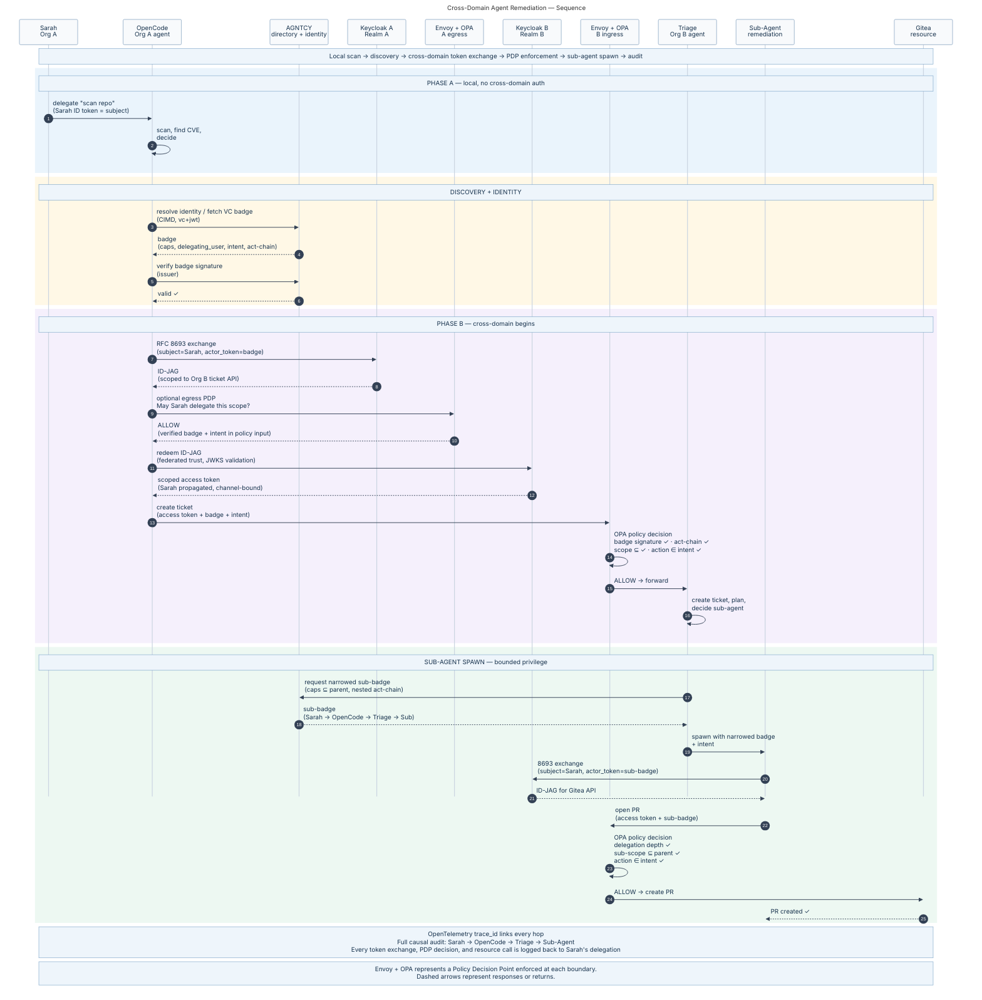

# Cross-Domain Agent Remediation — Sequence Diagram

```mermaid
---
title: Cross-Domain Agent Remediation — Sequence
config:
  theme: base
  fontFamily: "Inter, Arial, sans-serif"

  themeVariables:
    actorBkg: "#f8fafc"
    actorBorder: "#6b8fb3"
    actorTextColor: "#17324d"
    actorLineColor: "#cbd5e1"

    signalColor: "#334155"
    signalTextColor: "#17324d"

    noteBkgColor: "#eef5fb"
    noteBorderColor: "#7ba4c8"
    noteTextColor: "#17324d"

  sequence:
    mirrorActors: false
    wrap: true
    useMaxWidth: true
    messageAlign: left
---

sequenceDiagram
    title Cross-Domain Agent Remediation — Sequence
    autonumber

    participant S as Sarah<br/>Org A
    participant OC as OpenCode<br/>Org A agent
    participant AG as AGNTCY<br/>directory + identity
    participant KA as Keycloak A<br/>Realm A
    participant EA as Envoy + OPA<br/>A egress
    participant KB as Keycloak B<br/>Realm B
    participant EB as Envoy + OPA<br/>B ingress
    participant T as Triage<br/>Org B agent
    participant SA as Sub-Agent<br/>remediation
    participant G as Gitea<br/>resource

    Note over S,G: Local scan → discovery → cross-domain token exchange → PDP enforcement → sub-agent spawn → audit

    rect rgb(234, 244, 252)
        Note over S,G: PHASE A — local, no cross-domain auth
        S->>OC: delegate "scan repo"<br/>(Sarah ID token = subject)
        OC->>OC: scan, find CVE, decide
    end

    rect rgb(255, 248, 230)
        Note over S,G: DISCOVERY + IDENTITY
        OC->>AG: resolve identity / fetch VC badge<br/>(CIMD, vc+jwt)
        AG-->>OC: badge<br/>(caps, delegating_user, intent, act-chain)
        OC->>AG: verify badge signature<br/>(issuer)
        AG-->>OC: valid ✓
    end

    rect rgb(245, 240, 252)
        Note over S,G: PHASE B — cross-domain begins

        OC->>KA: RFC 8693 exchange<br/>(subject=Sarah, actor_token=badge)
        KA-->>OC: ID-JAG<br/>(scoped to Org B ticket API)

        OC->>EA: optional egress PDP<br/>May Sarah delegate this scope?
        EA-->>OC: ALLOW<br/>(verified badge + intent in policy input)

        OC->>KB: redeem ID-JAG<br/>(federated trust, JWKS validation)
        KB-->>OC: scoped access token<br/>(Sarah propagated, channel-bound)

        OC->>EB: create ticket<br/>(access token + badge + intent)
        EB->>EB: OPA policy decision<br/>badge signature ✓ · act-chain ✓<br/>scope ⊆ ✓ · action ∈ intent ✓
        EB->>T: ALLOW → forward
        T->>T: create ticket, plan,<br/>decide sub-agent
    end

    rect rgb(237, 248, 242)
        Note over S,G: SUB-AGENT SPAWN — bounded privilege

        T->>AG: request narrowed sub-badge<br/>(caps ⊆ parent, nested act-chain)
        AG-->>T: sub-badge<br/>(Sarah → OpenCode → Triage → Sub)

        T->>SA: spawn with narrowed badge + intent

        SA->>KB: 8693 exchange<br/>(subject=Sarah, actor_token=sub-badge)
        KB-->>SA: ID-JAG for Gitea API

        SA->>EB: open PR<br/>(access token + sub-badge)
        EB->>EB: OPA policy decision<br/>delegation depth ✓<br/>sub-scope ⊆ parent ✓<br/>action ∈ intent ✓

        EB->>G: ALLOW → create PR
        G-->>SA: PR created ✓
    end

    Note over S,G: OpenTelemetry trace_id links every hop<br/>Full causal audit: Sarah → OpenCode → Triage → Sub-Agent<br/>Every token exchange, PDP decision, and resource call is logged back to Sarah's delegation

    Note over S,G: Envoy + OPA represents a Policy Decision Point enforced at each boundary.<br/>Dashed arrows represent responses or returns.
```
