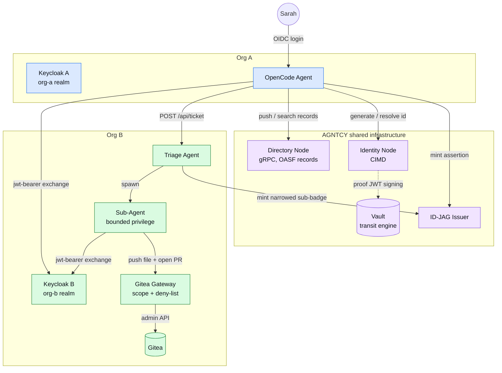
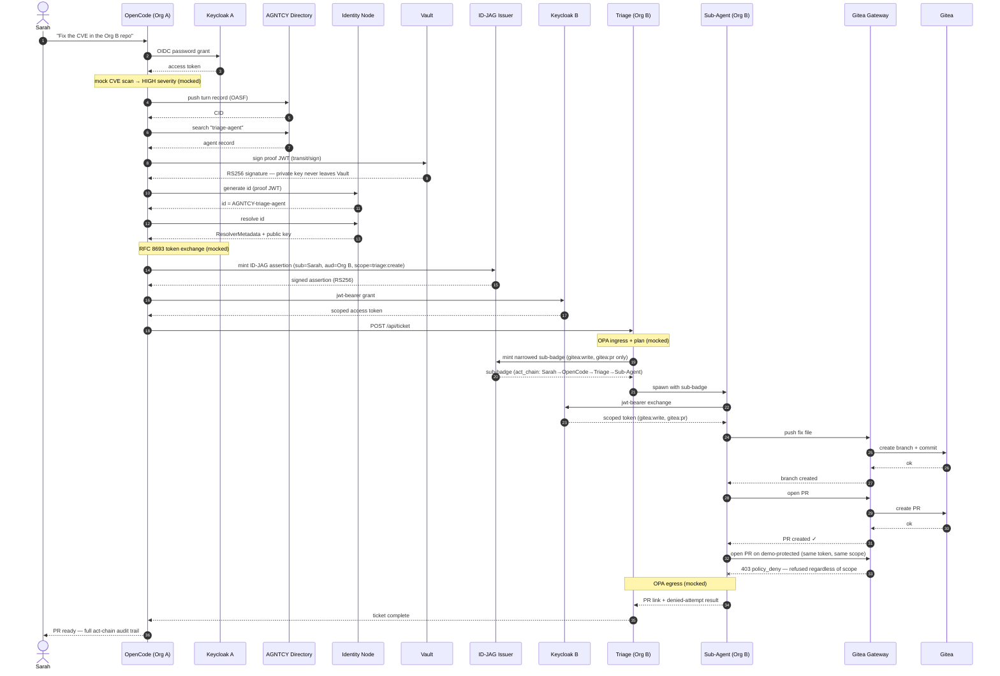

# Cross-Domain AI Agent Remediation Demo (ID-JAG + VC)

A cross-domain agent delegation scenario: **Sarah** (an engineer at **Org A**)
asks **OpenCode** (her Org A AI agent) to fix a CVE found in a repo owned by
**Org B**. Org B has its own Keycloak realm and access control, so OpenCode
can't act there directly — it asserts Sarah's delegation cross-domain using
**ID-JAG** (Identity Assertion JWT Authorization Grant), then Triage further
delegates a *narrowed* privilege to a bounded Sub-Agent that actually opens
the pull request.

It also wires in two AGNTCY components for real:

- **AGNTCY Directory Node** — every remediation turn is pushed as a
  content-addressed OASF record (immutable audit trail); agents are
  discoverable by name.
- **AGNTCY Identity Node (CIMD)** — Org A is registered as a real,
  **Vault-backed local trust authority**; agent identities are minted and
  resolved through identity-node's actual cryptographic proof-of-ownership
  flow, not a mock.

## What's real vs. mocked

| Step(s) | What | Real or mocked |
|---|---|---|
| 1 | Sarah's OIDC login at Keycloak A | **Real** |
| 2 | CVE scan | Mocked (no scanner integration) |
| 3–4 | AGNTCY Directory push + search (gRPC) | **Real** |
| 5–6 | CIMD generate/resolve id (Vault-signed proof JWT → identity-node) | **Real** |
| 7 | RFC 8693 token exchange at Keycloak A | Mocked |
| 8–9 | ID-JAG mint + Keycloak B `jwt-bearer` redemption | **Real** |
| 10–13 | Ticket creation, OPA ingress check, plan, sub-badge mint | OPA mocked; ticket + mint real |
| 14 | Sub-Agent spawned with the narrowed badge | **Real** |
| 15–18 | Sub-Agent `jwt-bearer` exchange, push file, open PR (via gitea-gateway) | **Real** |
| 19 | OPA egress check | Mocked |
| 20 | PR created, causal act-chain audit | **Real** |

Mocked steps are intentionally out of scope for this demo — see
`Envoy+OPA` in the compose file comments.

## Architecture



18 services on one Docker network (`cd-net`):

| Service | Image | Host port(s) | Purpose |
|---|---|---|---|
| `keycloak-a` | `quay.io/keycloak/keycloak:26.7` | `8082` | Org A IdP (`org-a` realm), authenticates Sarah |
| `kc-a-init` | `quay.io/keycloak/keycloak:26.7` | _(one-shot)_ | Registers `triage:create` optional scope |
| `keycloak-b` | `quay.io/keycloak/keycloak:26.7` | `8083` | Org B IdP (`org-b` realm), redeems ID-JAG assertions |
| `kc-b-init` | `quay.io/keycloak/keycloak:26.7` | _(one-shot)_ | Registers `triage:create`/`gitea:*` optional scopes |
| `idjag-issuer` | built from `../archive/single-org-id-jag-app-access/idjag-issuer` | `9002` | Mints ID-JAG assertions (stand-in issuer) |
| `identity-postgres` | `postgres:16` | _(internal)_ | DB for identity-node |
| `identity-vault` | `hashicorp/vault:1.17` | _(internal)_ | Holds the org-a trust-authority signing key (Transit engine) |
| `identity-node` | `ghcr.io/agntcy/identity/node:0.0.23` | `4005` (REST), `4006` (gRPC) | AGNTCY identity node — CIMD id generate/resolve |
| `identity-node-init` | `python:3.12-slim` | _(one-shot)_ | Bootstraps Vault Transit + registers org-a as trust authority |
| `dir-postgres` | `postgres:16` | _(internal)_ | Search index DB for the Directory |
| `dir-zot` | `ghcr.io/project-zot/zot:v2.1.17` | `5556` | OCI registry backing the Directory's content-addressed storage |
| `dir-apiserver` | `ghcr.io/agntcy/dir-apiserver:v1.6.0` | `8888` | AGNTCY Directory Node (gRPC only) |
| `agent-dir-init` | built from `./agent-dir-init` | _(one-shot)_ | Pushes static OASF records for all 3 demo agents |
| `gitea` | `gitea/gitea:1.22` | `3002` (HTTP), `2223` (SSH) | Protected resource (repo server) |
| `gitea-init` | `gitea/gitea:1.22` | _(one-shot)_ | Seeds the Gitea admin + demo repo |
| `gitea-gateway` | built from `../archive/single-org-id-jag-app-access/gitea-gateway` | `9103` | Enforces narrow scope + deny-list in front of Gitea |
| `opencode-agent` | built from `./opencode-agent` | `8101` | Org A mock agent (Phase A/B driver) |
| `triage-agent` | built from `./triage-agent` | `8200` | Org B mock agent (ticket → sub-badge → spawn) |
| `sub-agent` | built from `./sub-agent` | `8300` | Org B bounded-privilege mock agent (push + PR) |
| `webapp` | built from `./webapp` | `8090` | Animated sequence-diagram demo UI |

## Sequence flow

Every hop below actually happens against the real services in this stack
(Keycloak, Vault, identity-node, dir-apiserver, Gitea) — the only mocked
steps are the CVE scan itself and the two OPA policy checkpoints, called out
explicitly in the diagram. This is the same flow the webapp's UI animates
step by step.



## Quick start

```bash
cd demos/cross-domain-id-jag-vc
cp .env.example .env
# SARAH_PASSWORD / OPENCODE_CLIENT_SECRET / TRIAGE_CLIENT_SECRET /
# SUB_AGENT_CLIENT_SECRET must stay as the .env.example defaults (or be
# changed to match keycloak-a/org-a-realm.json + keycloak-b/org-b-realm.json)
# — everything else can be freely changed.

docker compose up -d --build
```

First boot takes ~3–5 minutes (Keycloak + identity-node + Directory cold
start). Watch it settle:

```bash
docker compose logs -f
```

Wait until these one-shot containers exit 0: `kc-a-init`, `kc-b-init`,
`gitea-init`, `identity-node-init`, `agent-dir-init`.

## Testing

### Via the webapp (recommended)

Open **http://localhost:8090**. Click **Run (animated)** to watch all 20
steps execute with live sequence-diagram highlighting and a step-by-step
explainer toast, or **Next step ▶** to step through manually.

### Via the API directly

```bash
# Full sequence
curl -s -X POST http://localhost:8090/api/run \
  -H 'Content-Type: application/json' \
  -d '{"cve":"CVE-2024-12345","repo":"demo-admin/payments-service"}' | jq .

curl -s http://localhost:8090/api/health
curl -s http://localhost:8090/api/config | jq .

# Individual steps (step-through mode)
curl -s -X POST http://localhost:8090/api/step/cimd-generate-id \
  -H 'Content-Type: application/json' -d '{"sub":"triage-agent"}' | jq .
```

You can re-run `/api/run` repeatedly — every push branch is randomized
server-side, so repeat runs don't collide with a prior run's branch/PR.

### Spot-checking individual services

```bash
curl http://localhost:8082/realms/org-a/.well-known/openid-configuration | jq .issuer
curl http://localhost:8083/realms/org-b/.well-known/openid-configuration | jq .issuer
curl http://localhost:9002/jwks | jq .
curl http://localhost:4005/v1alpha1/issuer/org-a/.well-known/jwks.json | jq .
curl http://localhost:9103/healthz
curl http://localhost:8200/health
curl http://localhost:8200/.well-known/agent.json | jq .name
grpcurl -plaintext localhost:8888 list   # Directory gRPC services (needs `brew install grpcurl`)
```

## How CIMD actually works (the identity-node "gotcha")

identity-node's real REST API has **no** `/apps` or `/badges` endpoints — it
needs a **self-issued proof JWT** to call `/v1alpha1/id/generate` or
`/v1alpha1/id/resolve`:

1. `identity-node-init` creates an RSA-2048 key in Vault's **Transit** engine
   (`org-a-issuer`) — the private key never leaves Vault.
2. It reads back the public key, builds a JWK (parsing the PEM by hand — no
   crypto library needed since Vault does the signing), and self-signs a
   proof JWT (`iss=agntcy:org-a`, a `sub_jwk` claim carrying that public key)
   via Vault's `/transit/sign` API.
3. It registers **org-a** as a local trust authority with that proof
   (`POST /v1alpha1/issuer/register`).
4. Every subsequent CIMD call — including the ones the webapp makes live —
   signs a **fresh** proof JWT the same way to mint (`AGNTCY-<agent>`) or
   resolve an id under org-a's authority.

Two non-obvious requirements if you're extending this: identity-node
validates the submitted public key on registration (`ValidatePubKey`), and
`jws.Verify` requires a matching `kid` on both the JWK and the JWS header —
omit either and you'll get an opaque failure with no useful error message.

## Troubleshooting

- **`dir-zot` / `dir-apiserver` show no healthcheck / stay "starting"** — both
  images are distroless (no shell, no `nc`, no `wget`). Their `depends_on`
  conditions are `service_started`, not `service_healthy`, by design.
- **`gitea-init` fails with "not supposed to be run as root"** — make sure
  `user: git` is set on the `gitea-init` service (already in the compose
  file); Gitea refuses to run its CLI as root otherwise.
- **`identity-node-init` loops on HTTP 404** — this is expected during
  startup; the probe just checks the REST gateway is routing at all (any
  structured response, even 404, means it's up).
- **CIMD steps return `ERROR_REASON_INVALID_PROOF` / `INVALID_ISSUER`** — the
  proof JWT's `iss` common name must exactly match a *registered* issuer's
  common name, and the JWK must include a `kid` (see above).
- **Directory push fails with an OASF schema validation error** — the real
  `schema.oasf.agntcy.org` may not resolve from your network; the compose
  file points `DIRECTORY_SERVER_OASF_API_VALIDATION_SCHEMA_URL` at
  `https://schema.oasf.outshift.com` instead. Skill/domain names must be
  real OASF taxonomy entries (e.g. `software_engineering/code_quality/code_review`),
  not made-up strings.
- **Repeat `/api/run` calls fail at push-file/open-pr with "branch already
  exists"** — `gitea-gateway` (shared with the archived `single-org-id-jag-app-access`
  demo) now randomizes the branch name per push; if you're on an older image,
  rebuild it (`docker compose build gitea-gateway`).
- **Port already in use** — this stack's default ports are chosen to avoid
  colliding with `single-org-id-jag-app-access`'s defaults; if something else
  on your machine still collides, override the `*_PORT` variables in `.env`.

## Repo layout

```
cross-domain-id-jag-vc/
├── docker-compose.yaml        # the 18-service stack (source of truth)
├── .env.example
├── identity-node-init.py      # Vault Transit bootstrap + org-a issuer registration
├── keycloak-a/, keycloak-b/   # realm import JSON + scope bootstrap scripts
├── gitea/                     # Gitea admin/repo seed script
├── dir/                       # Zot OCI registry config
├── agent-dir-init/            # one-shot: pushes static OASF records for all agents
├── opencode-agent/            # Org A mock agent (Phase A/B)
├── triage-agent/              # Org B mock agent (ticket → sub-badge → spawn)
├── sub-agent/                 # Org B bounded-privilege mock agent
└── webapp/                    # animated sequence-diagram demo UI (FastAPI + vanilla JS)
```
