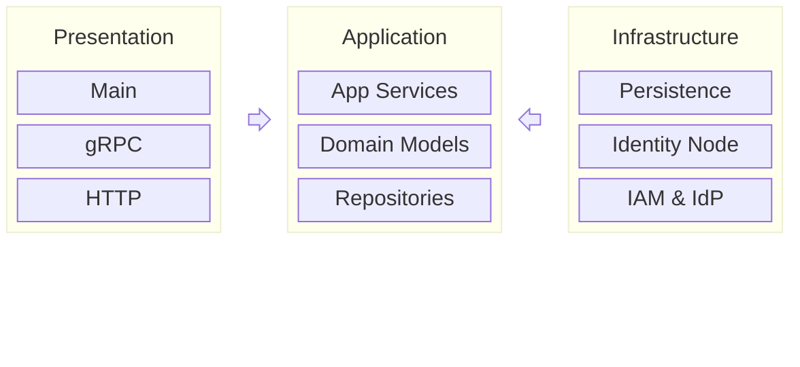

# Agent Identity Backend Architecture

The overall Agent Identity backend architecture is shown in this diagram:



**Note:** The arrows indicate the dependency direction between the layers.

The purpose of each layer is described as below:

- **Presentation Layer:** Responsible for bootstrapping the system, implementing the gRPC services, delegating requests to the Application layer and sending responses back to clients. The main packages of this layer:
  - [`cmd/bff`](https://github.com/agntcy/identity-service/tree/main/backend/cmd/bff)
  - [`internal/bff/grpc`](https://github.com/agntcy/identity-service/tree/main/backend/internal/bff/grpc).
- **Application Layer:** Orchestrates and implements the core business logic of the system. App Services within this layer are responsible for enforcing business rules, processing validations, and coordinating workflows involving domain models, persistence and external systems. The main packages of this layer:
  - [`internal/bff`](https://github.com/agntcy/identity-service/tree/main/backend/internal/bff): Implements the App Services.
  - [`internal/core`](https://github.com/agntcy/identity-service/tree/main/backend/internal/core): Implements the domain models and rest of the layer.
- **Infrasturcture Layer:** Responsible for managing technical concerns such as data persistence (repository implementation) and integration with external systems (Identity Node, IAM, IdPs, etc.). The main packages of this layer:
  - [`internal/core`](https://github.com/agntcy/identity-service/tree/main/backend/internal/core): each domain contains the concrete implementation of the repositories and/or the adapters for the external systems.
  - [`internal/pkg`](https://github.com/agntcy/identity-service/tree/main/backend/internal/pkg): part of this package contains adapters for external systems that are not associated with a specific domain, such as [`internal/pkg/iam`](https://github.com/agntcy/identity-service/tree/main/backend/internal/pkg/iam) and [`internal/pkg/vault`](https://github.com/agntcy/identity-service/tree/main/backend/internal/pkg/vault).

## Bootstrapping

The [`main()`](https://github.com/agntcy/identity-service/blob/main/backend/cmd/bff/main.go) function is responsible for initializing and running all components required by the backend. Its primary tasks include:

1. Loading configuration
2. Establishing a database connection
3. Running database migrations
4. Initializing App Services and injecting their dependencies
6. Starting the gRPC and HTTP servers

### Configuration

The backend is configured using environment variables. Additionally, any values specified in the `.env` file are automatically loaded as environment variables at startup (a sample can be found here [`cmd/bff/.env.sample`](https://github.com/agntcy/identity-service/blob/main/backend/cmd/bff/.env.sample)). All configuration options for the system are defined in the `Configuration` struct located in [`cmd/bff/configuration.go`](https://github.com/agntcy/identity-service/blob/main/backend/cmd/bff/configuration.go).

### Dependency injection

In Agent Identity backend, dependency injection is performed manually using [constructors](https://go.dev/doc/effective_go#composite_literals). Components depend on eachother using interfaces rather than concrete implementation structs.

```golang
type ServiceA interface {}
type ServiceB interface {}

type serviceAImpl struct{}
func NewServiceA() ServiceA {
  return &serviceAImpl{}
}

type serviceBImpl struct{
  srvA ServiceA
}
func NewServiceB(srvA ServiceA) ServiceB {
  return &serviceBImpl{srvA}
}

sA := NewServiceA()
sB := NewServiceB(sA)
```

## Dependency management

[Go modules](https://pkg.go.dev/cmd/go#hdr-Modules__module_versions__and_more) are used to manage dependencies on external packages.

Adding a new dependency or updating an existing one is done with the `go get` command.

After importing the dependency in the code, tidy up the `go.mod` and `go.sum` files using the `go mod tidy` command.
