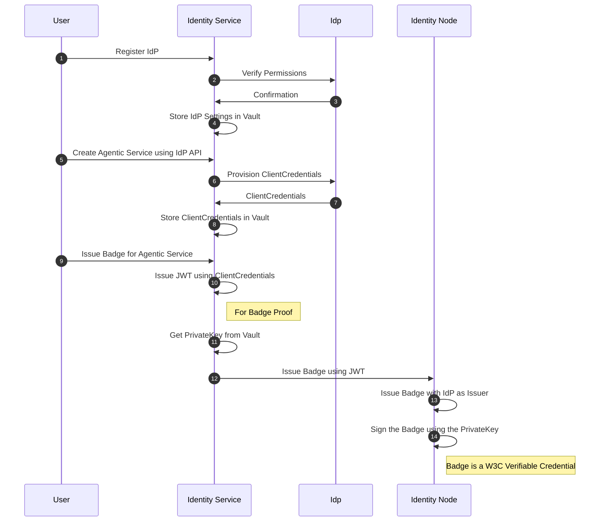
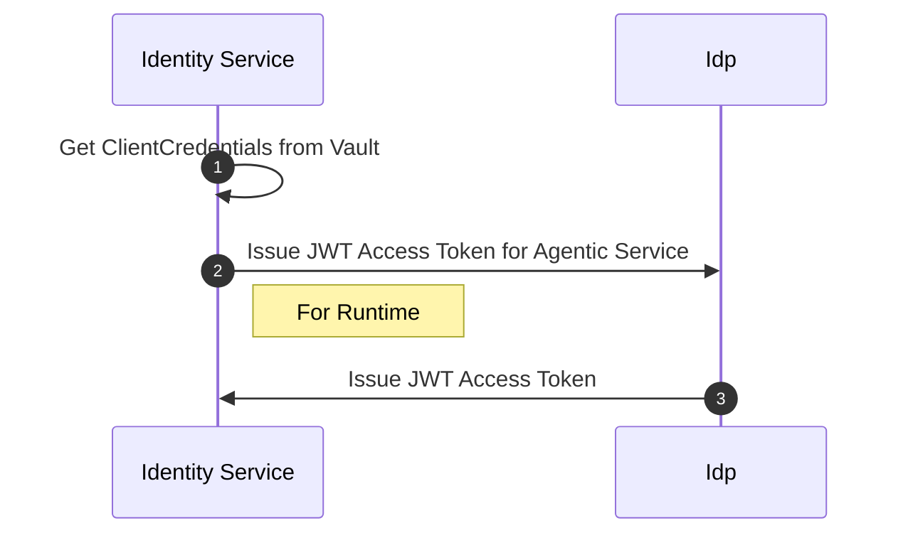
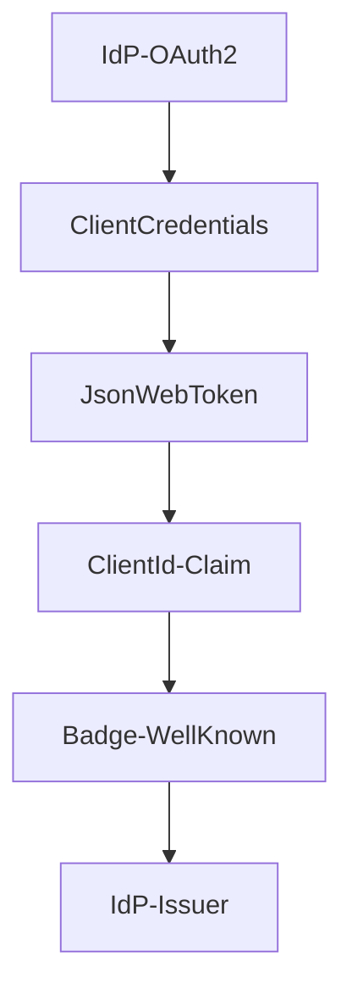
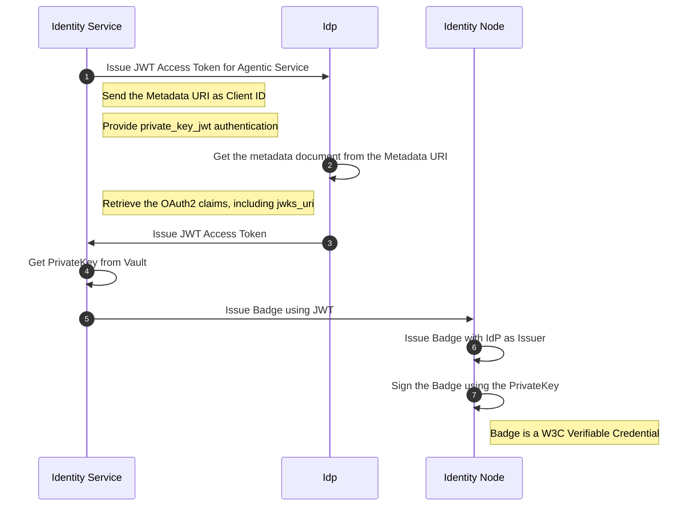
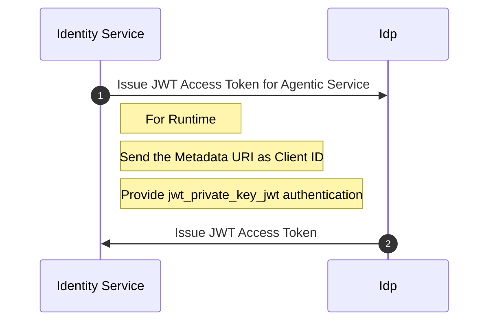
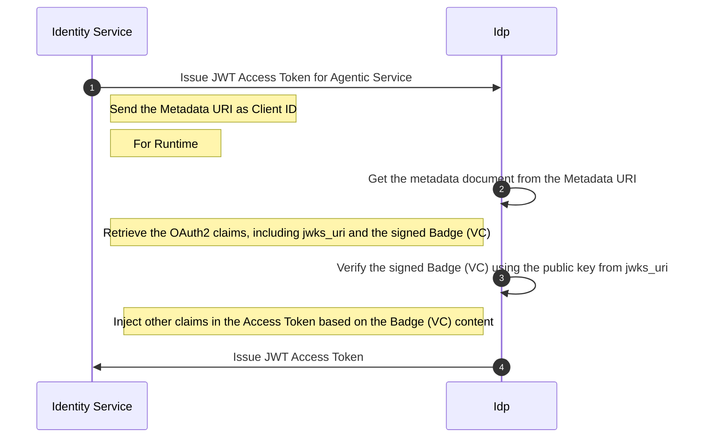
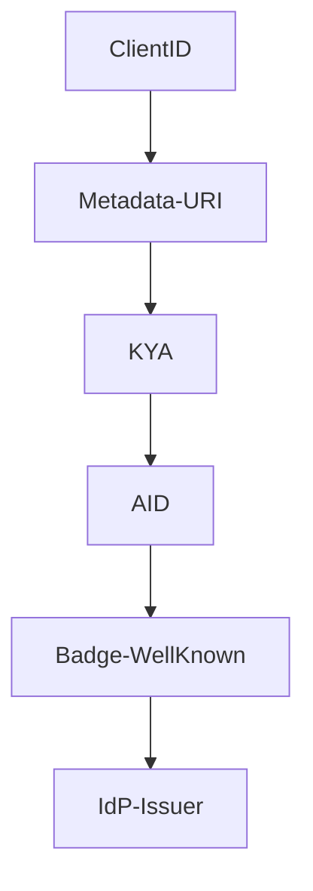

# Proposal: Dynamic Client Registration of Agentic Services

## Current State

This section covers the current state.

### Identity Provider (IdP) Integration

The `Identity Service` currently integrates IdPs (e.g. Okta, Duo, Ory, etc.) using their specific APIs for the following functions:

- Registration of ClientCredentials for Agentic Services (Agents, MCP Servers): for each new Agentic Service,
  a new ClientCredential must be created in the IdP.
- Rotation of Secrets: when a ClientCredential's secret is rotated, the new secret must be updated in both the IdP and the Agentic Service.

### Badges and Signature

For each tenant, the `Identity Service` generates a keypair and uses it to sign and verify badges for Agentic Services.
The keypair is stored in the `Identity Service` vault.

### Flow Diagrams

#### Provisioning Agentic Service with Badge

<!-- markdownlint-disable -->

<!-- markdownlint-enable -->

#### Agentic Service Access Token at Runtime

<!-- markdownlint-disable -->

<!-- markdownlint-enable -->

## Dynamic Client Registration (DCR) Proposal

To streamline the registration and management of Agentic Services, this proposal suggests implementing
Dynamic Client Registration (DCR) as defined in OAuth 2.0 and OpenID Connect specifications.
This would allow Agentic Services to register themselves dynamically with the `Identity Service`,
reducing manual configuration and improving interoperability.

However, since there is a new alternative standard called Client ID Metadata (OAuth Client ID Metadata Document), we are considering this approach instead of the traditional DCR.

### Client ID Metadata Document Proposal

In the current design the IdP and its ClientCredentials are chained with the Badges in the following way:

<!-- markdownlint-disable -->

<!-- markdownlint-enable -->

#### Metadata Document Structure

The Client Metadata must comply with the [OAuth Client ID Metadata Document](https://www.iana.org/assignments/oauth-parameters/oauth-parameters.xhtml#client-metadata).
The Client ID Metadata Document might contain the following fields:

- `client_id`: The unique identifier for the Agentic Service
- `client_name`: A human-readable name for the Agentic Service
- `token_endpoint_auth_method`: Use `private_key_jwt` for JWT-based authentication
- `jwks_uri`: The URI where the Agentic Service's public keys can be retrieved

#### New Flow Diagrams

##### Provisioning Agentic Service with Badge

<!-- markdownlint-disable -->

<!-- markdownlint-enable -->

#### Agentic Service Access Token at Runtime

<!-- markdownlint-disable -->

<!-- markdownlint-enable -->

## Extensions for draft-ietf-oauth-client-id-metadata-document-00

The Client ID Metadata Document contains claims defined by
[OAuth Client ID Metadata Document](https://www.iana.org/assignments/oauth-parameters/oauth-parameters.xhtml#client-metadata)
in relation with [RFC7592](https://datatracker.ietf.org/doc/html/rfc7592), such as `client_name`, `redirect_uris`, `token_endpoint_auth_method`, `jwks_uri`, etc.

These claims are OAuth2 generic and can be used in various contexts.
Specifically for Agentic Services, we can propose additional claims to enhance the functionality and interoperability of the services.

### Verifiable Credentials Extension (W3C)

The Agent Identity Service uses badges as Verifiable Credentials (VCs) based on the [W3C VC Data Model](https://www.w3.org/TR/vc-data-model-2.0/).
A badge is issued by the Identity Provider (IdP) and signed using a private key stored in the `Identity Service` vault.
Its claims contains information about the Agentic Service, such as its identity (ResolverMetadataID), Agent Card Definition or MCP Server's Tools and Resources.

In addition to send the keypair location using `jwks_uri`, we propose adding the signed badge (W3C Verifiable Credential) as an extension to the Client ID Metadata Document.
The VC can be therefore verified by the Identity Provider's Authorization Server using the public key retrieved from the `jwks_uri`.
Then Authorization Server might decide to include additional claims in the issued access tokens based on the VC's content.

The Client ID Metadata Document could now contain the following field:

- `vc+jwt`: A signed (W3C Verifiable Credential) in JOSE format.

Additional details in the flow diagram below:

<!-- markdownlint-disable -->

<!-- markdownlint-enable -->

### KYA (Know Your Agent) Extension (Skyfire)

KYA (Know Your Agent) is a Skyfire specification that links an Agentic Service to a verified person or business, ensuring trust and accountability in digital interactions.
Once verified, the agent receives a credential or token it can use to authenticate and make payments autonomously (`KYA+pay`).

A KYA token is a cryptographic credential issued by Skyfire that proves an AI agent's verified identity and trust status.
It's typically issued by a KYA Provider as a signed JSON Web Token (JWT) containing metadata about the agent (aid), user context and its verified owner (bid, ssi, btg).

To enhance the Client ID Metadata Document for Agentic Services, we can propose adding a KYA Token claim as an extension.

The Client ID Metadata Document could now contain the following field:

- `kya+jwt`: A signed KYA Token in JWT format.

The KYA Token could use the 'ResolverMetadataID' as the 'aid' (agent ID) claim to link the Agentic Service to its verified identity.

The identity chain would look like this:

<!-- markdownlint-disable -->

<!-- markdownlint-enable -->
