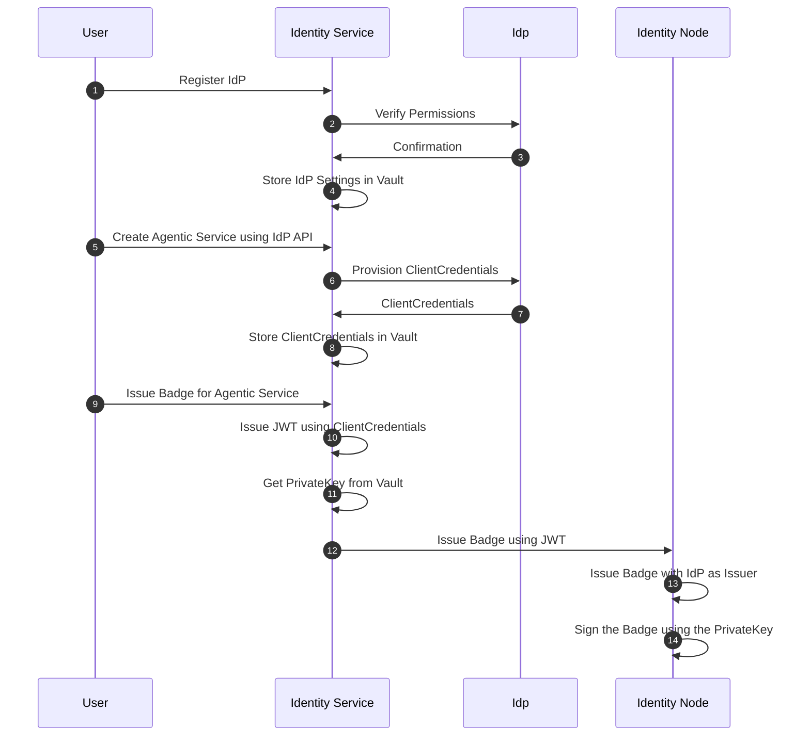
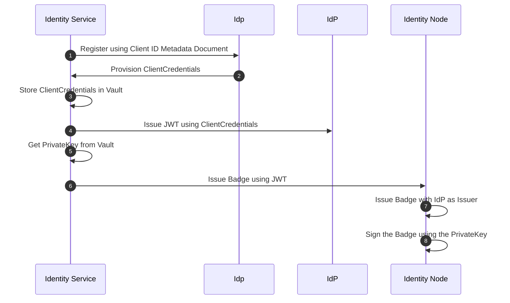

# Proposal: Dynamic Client Registration of Agentic Services

## Current State

### Identity Provider (IdP) Integration

The `Identity Service` currently integrates IdPs (e.g. Okta, Duo, Ory...) using their specific APIs for the following functions:

- Registration of ClientCredentials for Agentic Services (Agents, MCP Servers): for each new Agentic Service, a new ClientCredential must be created in the IdP,
- Rotation of Secrets: when a ClientCredential's secret is rotated, the new secret must be updated in both the IdP and the Agentic Service.

### Badges and Signature

For each tenant, the `Identity Service` generates a key pair and uses it to sign and verify badges for Agentic Services. The keypair is stored in the `Identity Service` vault.

### Flow Diagram

## Dynamic Client Registration (DCR) Proposal

To streamline the registration and management of Agentic Services, this proposal suggests implementing Dynamic Client Registration (DCR) as defined in OAuth 2.0 and OpenID Connect specifications. This would allow Agentic Services to register themselves dynamically with the `Identity Service`, reducing manual configuration and improving interoperability.

However, since there is a new alternative standard called Client ID Metadata (OAuth Client ID Metadata Document), we are considering this approach instead of the traditional DCR.

### Client ID Metadata Document Proposal

In the current design the IdP and its ClientCredentials are chained with the Badges in the following way:

#### Metadata Document Structure

The Client Metadata must comply with the [OAuth Client ID Metadata Document](https://www.iana.org/assignments/oauth-parameters/oauth-parameters.xhtml#client-metadata).
The Client ID Metadata Document might contain the following fields:

- `client_id`: The unique identifier for the Agentic Service
- `client_name`: A human-readable name for the Agentic Service
- `token_endpoint_auth_method`: Use `private_key_jwt` for JWT-based authentication
- `jwks_uri`: The URI where the Agentic Service's public keys can be retrieved

#### New Flow Diagram

